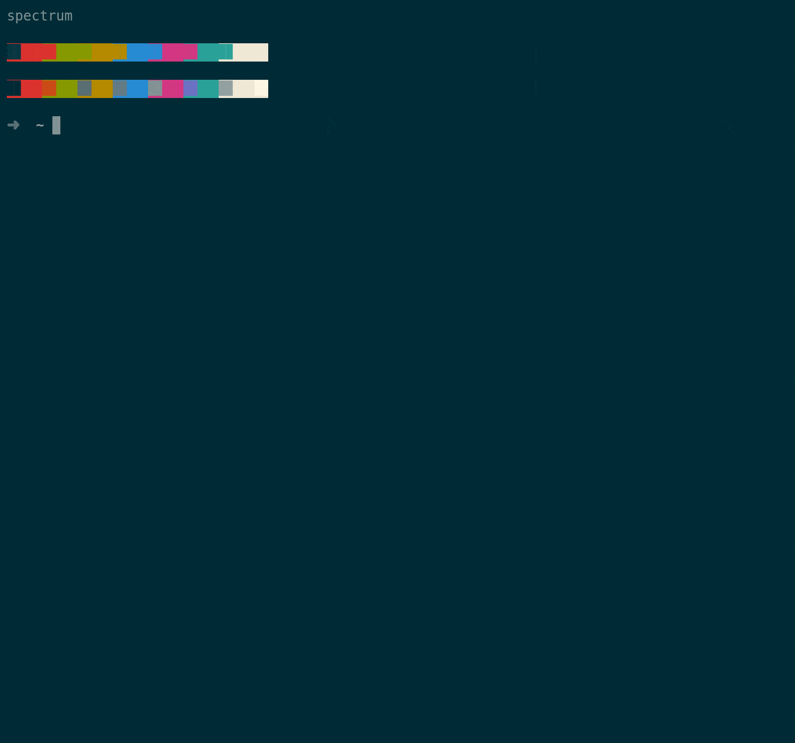
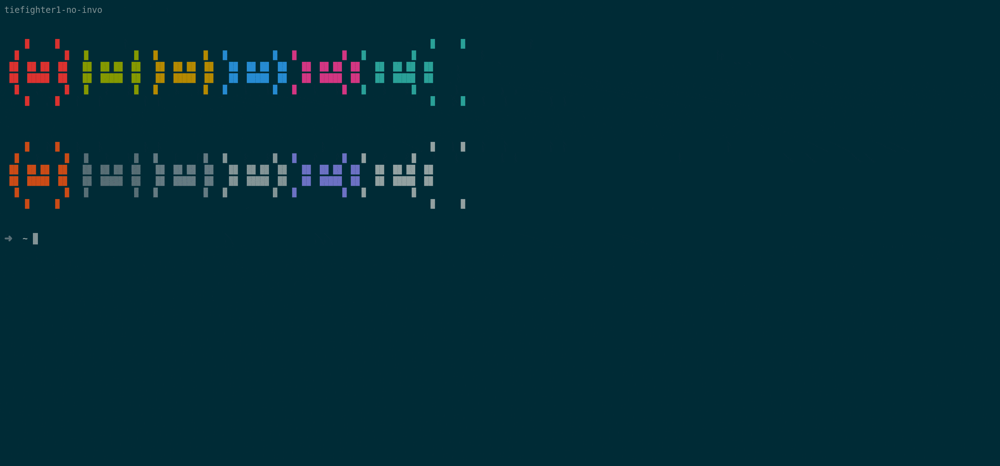
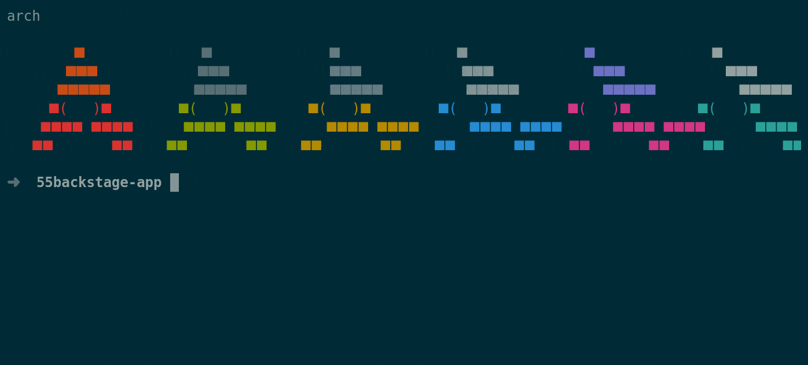

# Welcome to the Backstage Demo 

<span style="width:100%">[](https://forthebadge.com)
[](https://forthebadge.com)
[](https://forthebadge.com)
</span>

<span style="width:100%">[](https://forthebadge.com)
[](https://forthebadge.com)
[](https://forthebadge.com)
</span>

## About the Workshop 


<!--  -->


#### Prerequisite to Deploy backstage locally 

```bash

# User must have node, npm, npx, Docker and Docker Compose.  
sudo apt update
sudo apt install nodejs -y 
sudo apt install npm -y 

# Installing npx 
sudo npm i npx -g # To install it globally in the linux 

# For Windows in cmd 


# Installing Docker and Docker Compose 

sudo apt update
sudo apt install docker-ce -y 

# To installl docker compose 

sudo curl -L "https://github.com/docker/compose/releases/download/1.29.2/docker-compose-$(uname -s)-$(uname -m)" -o /usr/local/bin/docker-compose

sudo chmod +x /usr/local/bin/docker-compose

sudo ln -s /usr/local/bin/docker-compose /usr/bin/docker-compose

docker-compose --version


```
#### Instructions to set up the Bakstage stage application


```bash 

# create application 55backstage app
npx @backstage/create-app

```

* It will prompt for the `Backstage name`
* Please use `Postgres SQL` as the database when it prompt.





```bash 

# Please enter the name of the backstage applcation 
cd <Backstage_Applcation_name> # 55backstage-app can 


# This will create a docker compose file. 

cat <<EOF >$(pwd)/docker-compose.yaml
version: '3'
services:
  db:
    image: postgres
    restart: always
    environment:
      POSTGRES_USER: postgres 
      POSTGRES_PASSWORD: password@123
    ports:
      - 5430:5432
EOF

# Now we have to make our database up and running 
docker-compose up 

```




```bash

# It will replace all the variables in the app config file 
sed -i 's/${POSTGRES_HOST}/localhost/g' app-config.yaml ; sed -i 's/${POSTGRES_PORT}/5430/g' app-config.yaml ; sed -i 's/${POSTGRES_USER}/postgres/g' app-config.yaml ; sed -i 's/${POSTGRES_PASSWORD}/password@123/g' app-config.yaml

# To clean the pre-existing components from the backstage 


# To start the backend application 
yarn start-backend

```


```bash 
# To start the frontend application 
yarn start 

```


#### A short summary of how we setup the backstage application

```bash 

# Directory structure for our backstage template 

├── catalog
│   ├── catalog-info.yaml
│   └── info
│       ├── api-1.yaml
│       ├── api-2.yaml
│       ├── component.yaml
│       ├── domain.yaml
│       ├── group.yaml
│       ├── resource-1.yaml
│       ├── resource-2.yaml
│       ├── system.yaml
│       ├── user-1.yaml
│       ├── user-2.yaml
│       └── user-3.yaml
├── docker-compose.yaml
├── docs
│   ├── index.md
│   └── integrations
│       ├── catalog.md
│       └── techdocs.md
├── mkdocs.yml
├── README.md
├── template
│   ├── info.sh
│   └── src
│       └── ${{ values.service_name }}
│           └── index.js
└── template.yaml


```
