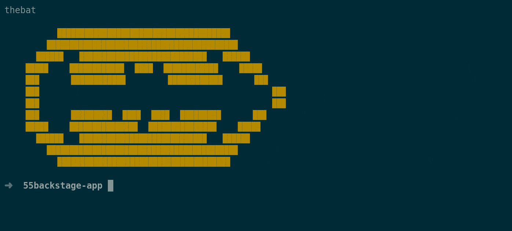

# Welcome to the Backstage Demo 

<span style="width:100%">[](https://forthebadge.com)
[](https://forthebadge.com)
[](https://forthebadge.com)
</span>

<span style="width:100%">[](https://forthebadge.com)
[](https://forthebadge.com)
[](https://forthebadge.com)
</span>

## About the Workshop 


#### Instructions to set up the Bakstage stage application 


#### To setup npx and node js in linux 

```bash
sudo apt update
sudo apt install nodejs -y 
sudo apt install npm -y 

# Installing npx 
npm i npx -g # To install it globally in the linux 

# create application 55backstage app
npx @backstage/create-app

```


#### To setup the application we used `postgres` as the database

#### Make sure that you have installed Docker and docker compose for this setup 

```bash 

# Docker and Docker compose must be installed before the setup 
sudo apt update
sudo apt install docker-ce -y 

# To installl docker compose 

sudo curl -L "https://github.com/docker/compose/releases/download/1.29.2/docker-compose-$(uname -s)-$(uname -m)" -o /usr/local/bin/docker-compose

sudo chmod +x /usr/local/bin/docker-compose

sudo ln -s /usr/local/bin/docker-compose /usr/bin/docker-compose

docker-compose --version

cd backstage_application 

# It will create the database 

cat <<EOF >$(pwd)/docker-compose.yaml
version: '3'
services:
  db:
    image: postgres
    restart: always
    environment:
      POSTGRES_USER: postgres 
      POSTGRES_PASSWORD: password@123
    volumes: 
      - database-data:/var/lib/postgresql/data/
    ports:
      - 5430:5432

volumes:
    database-data:
EOF

```


```bash
# It will replace all the variables in the app config file 
sed -i 's/${POSTGRES_HOST}/localhost/g' app-config.yaml ; sed -i 's/${POSTGRES_PORT}/5430/g' app-config.yaml ; sed -i 's/${POSTGRES_USER}/postgres/g' app-config.yaml ; sed -i 's/${POSTGRES_PASSWORD}/password@123/g' app-config.yaml

# To start the backend application 
yarn start-backend

```


```bash 
# To start the frontend application 
yarn start 

```


#### A short summary of how we setup the backstage application


